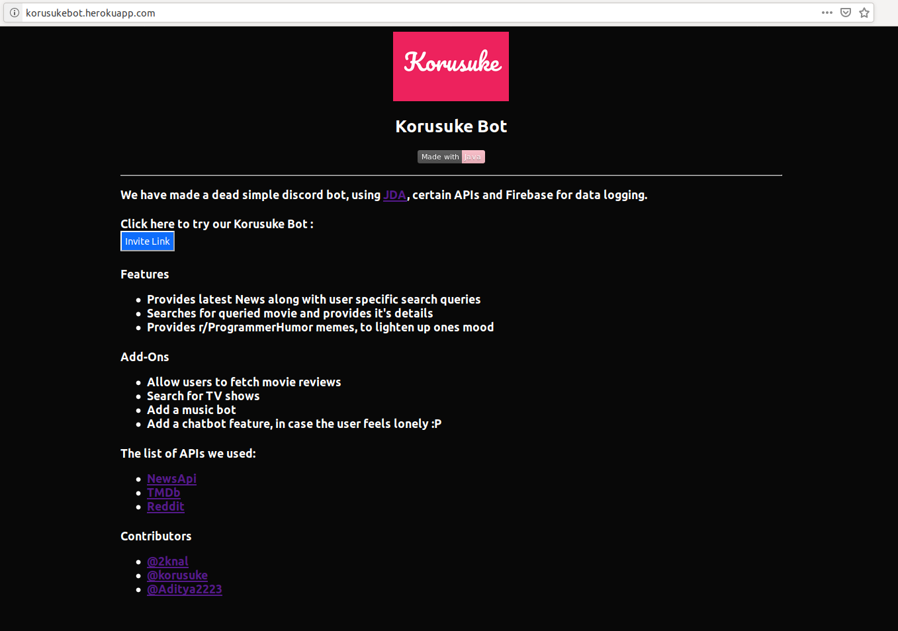

<p align="center">
  <a href="" rel="noopener">
 </a>
</p>

<h3 align="center" >Korusuke Bot</h3>

<div align="center">

[](https://www.java.com/)
[](http://hits.dwyl.io/2knal/Probably-OOPM)
[](http://korusukebot.herokuapp.com/)
<br>

</div>

------------------------------------------

We have made a dead simple discord bot, using [JDA](https://github.com/DV8FromTheWorld/JDA), certain APIs and Firebase for data logging.

------------------------------------------
### Features

- Provides latest News along with user specific search queries

- Searches for queried movie and provides it's details

- Provides [r/ProgrammerHumor](https://www.reddit.com/r/ProgrammerHumor/) memes, to lighten up ones mood

------------------------------------------
### Add-Ons

- [x] Allow users to fetch movie reviews 
- [x] Search for TV shows
- [ ] Add a music bot
- [ ] Add a chatbot feature, in case the user feels lonely :P

------------------------------------------
### The list of APIs and Services we used

- [NewsApi](https://newsapi.org/)
- [TMDb](https://www.themoviedb.org/)
- [Reddit](https://www.reddit.com/)
- [Firebase](https://firebase.google.com/docs/firestore/)

------------------------------------------
### Setup (LocalHost : 8080)
1. First get respective API keys (mentioned above) and add it to the places marked by ```TODO: Add API key```.
2. Stage gradle by adding your own configuration, with gradle selected and ```stage``` added to tasks.
3. Execute this process by clicking on the green run button.
4. Finally, execute ```run_heroku.sh```.

------------------------------------------
### Setup (Heroku)

[](https://dashboard.heroku.com)

1. [Create a new bot account.](https://discordapp.com/developers/applications/me)
2. [Sign up for a free Heroku account.](https://signup.heroku.com)
3. Click the button above.
4. Fill in the token and role IDs. 
5. Click 
6. Heroku will build and deploy the bot in about 30 seconds.
7. Click 

If you configured the bot correctly clicking view should take you to a page like:
<br>
</a>

------------------------------------------
### Contributors

- [@2knal](https://github.com/2knal)
- [@korusuke](https://github.com/korusuke)
- [@Aditya2223](https://github.com/Aditya2223)

<br>
<br>

> This Repo is for our college mini project on Object Oriented Programming.
